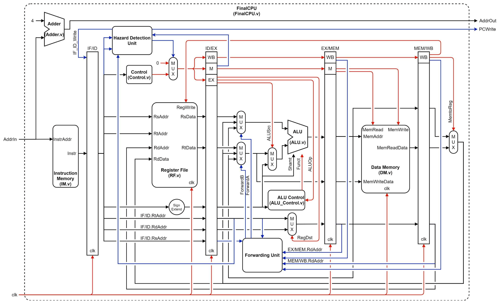

# MIPS_CPU
Implementation of Single-cycle CPU and 5-stage pipeline CPU

# Single-cycle CPU
Supporting R-format, I-format, and J-format instructions

)

# 5-stage Pipeline CPU
Supporting 5-stage pipeline by adding buffers in Single-cycle CPU.

